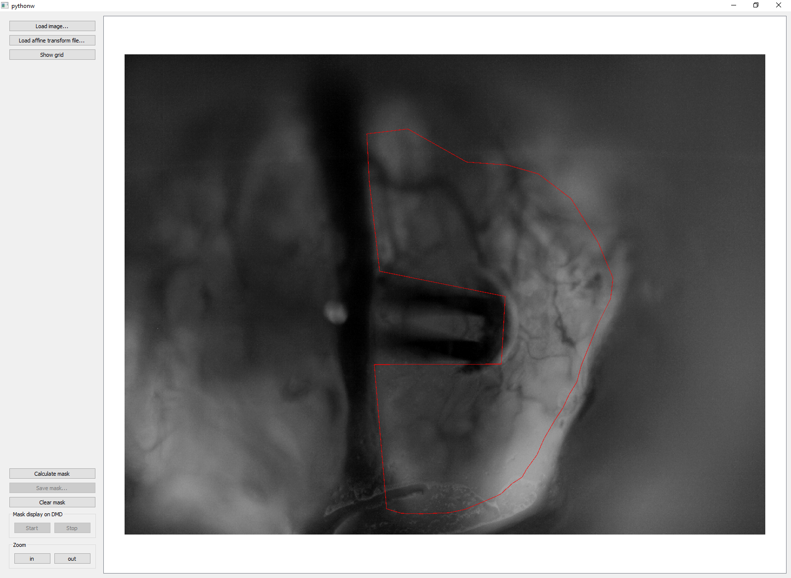

# DMDlib

This package provides an interface between Python and the Vialux ALP v 4.2 API Digital Micromirror Device (DMD). 

The Python API extension was written to enable neuroscience experiments using patterned optogenetic
stimulation. It includes programs to allow for projecting random stimulation patterns used in recovering receptive fields 
of neurons and a GUI to allow selection of stimulus ROIs.

# Installation

Install with `$ python setup.py install`.

### Requirements
All of these are satisfied with recent versions of Anaconda Python Distribution except cv2.
* Python >=3.5
* numpy
* numba
* pytables
* OpenCV2 (cv2)

### ALP v4.2 installation.

To use this software with an Vialux ALP 4.2 device, you must first install the ALP software and drivers:
https://www.vialux.de/en/download.html

Once installed, locate the installation folder and find the _alpV42.dll_ file. If you installed the ALP software to C:\\,
the directory will be:

` C:\ALP-4.2\ALP-4.2 high-speed API\x64\`
 
Add this directory to your Windows system path. You can find references for how to do this online. You must (?) restart 
your computer after doing this for the path to be changed.
 
# Packages: 
## core
This contains an interface with DMD driver interfaces and support files.

## mask_maker
This is a PyQt-based program that allows for a selection of an ROI in which to stimulate. To use, run `mask_maker` from 
the command line. This allows specification of the area in which you'd like to stimulate to avoid hitting the 
recording electrodes with light.
1. load a file and an affine transform matrix (camera to dmd)
2. click on the image to define an inclusion polygon
3. calculate the mask. This takes a few seconds.
4. you can test your polygon and affine transform by projecting the mask onto the sample.
5. Save the mask.npy file for use with the following projection patterns.

This also includes a iPython notebook that guides the user through fitting the affine transform to convert
image space to DMD pixel space.

## randpatterns
This package was written to allow random pattern stimulation sequences to be projected on the bulb. It is semi-optimized
using a combination of Numpy and Numba JITed functions to allow for >100 Hz stimulation framerates. It is multithreaded 
to allow asynchronous IO during stimulus generation and upload.

It consists of 1 GUI for ROI selection and two command-line programs to generate, save, and upload the patterns to the
DMD device.

## sparsenoise
This is a command-line program that generates and projects random patterns using the DMD device. To get help with this,
run the `sparsenoise -h` to list all parameters needed.

Importantly, this is expecting openephys to be running concurrently with the pattern projection. If you need to use this
without openephys, please contact Chris.

