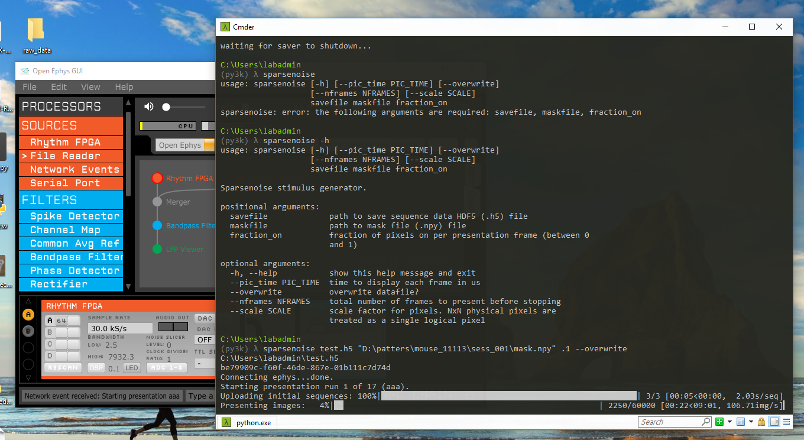

# randpatterns
This package was written to allow random pattern stimulation sequences to be projected on the bulb. It is semi-optimized
using a combination of Numpy and Numba JITed functions to allow for >100 Hz stimulation framerates. It is multithreaded 
to allow asynchronous IO during stimulus generation and upload.

It consists of 1 GUI for ROI selection and two command-line programs to generate, save, and upload the patterns to the
DMD device.

## Structure

The program uses a main function living in each of the protocol modules (scanner, sparsenoise, whitenoise).
This this module main functio preforms some error checking and passes that protocol's stimulus generation 
definition to a `run_presentations` function in the shared.py package.  

This call runs multiple blocks of presentations based on the input parameters, using the "presenter" function
__The presenter should be a class__

### Stimulus generators 
Stimulus generators _modify_ boolean numpy ndarrays in place for performance reasons. The parameters are:

    seq_array_bool: n x (dmd.h / scale) x (dmd.w / scale) array that is going to be scaled.
    param seq_array: n x dmd.h, x dmd.w array that is going to be uploaded to dmd
    param scale: logical pixels to physical pixel scaling factor. i.e. scale=4 means that the image is made up of
    homogeneous elements of 4x4 pixel squares.
    param mask: boolean mask of w, h = dmd.w, dmd.h . Everything that is 0 is forced to 0.
    param npixels: number of pixels to present per presentation frame
    param gap_frames: number of frames between presentation frame. Default 0, where every frame is a presentation frame.
    
Concrete examples exist in sparsenoise, scanner, and whitenoise modules.

## Running

All protocol modules can be run from the command line and have help built in.

To access help: `sparsenoise -h`

Currently there are 3:
* sparsenoise (can adjust the probability of pixels being on in the frame)
* whitenoise (each pixel has 0.5 probability of being on in a frame)
* scanner (one pixel at a time)
* multisparse (presents blocks of sparse noise with different statistics in each block)

Importantly, this is expecting openephys to be running concurrently with the pattern projection. If you need to use this
without openephys, please contact Chris.

