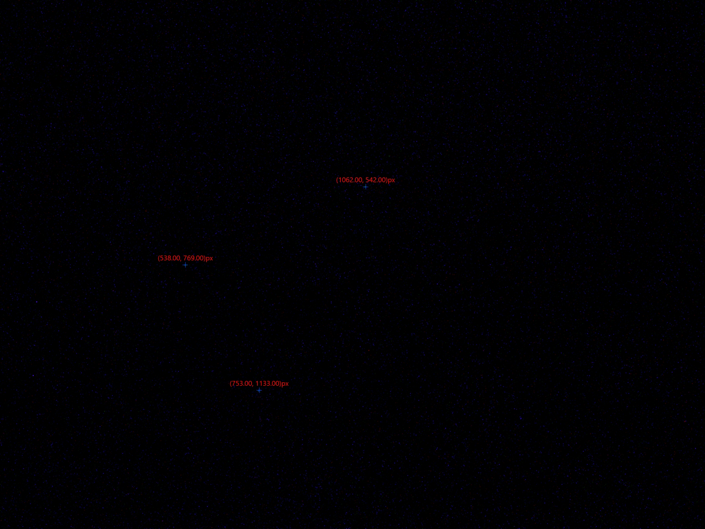
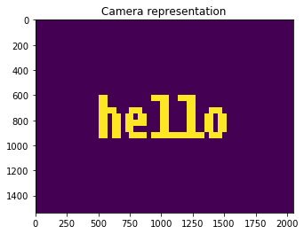
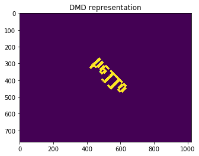

```python
import numpy as np
import PIL
import cv2
import matplotlib.pyplot as plt
from dmdlib.ALP import *
%matplotlib inline
```

# DMD to camera transform

We need to "calibrate" our DMD image to match what we see on the camera. Then, as we're working in camera image coordinates, we know what DMD coordinates match this.

## DMD projection
First we're going to project an image with three known spots that form a triangle from the DMD onto a sample. It's best to use a fluorescein slide or something that is fluorescent and accurate.

This function returns the coordinates of the pixels that were projected. The pixels should be in order horizontally on the DMD, typically from _left to right_. __This may be inverted, however, depending on how the camera is oriented, so you might have to play around with the ordering if the testing doesn't work out!!__


```python
dmd = np.array(disp_affine_pattern(), dtype='float32')
```

    (1, 768, 1024)
    Press Enter key to end...
    


```python
dmd  # known pixel coordinates displayed on the DMD.
```


    array([[ 450.,  300.],
           [ 550.,  275.],
           [ 500.,  430.]], dtype=float32)


## Capture and get coordinates.
Using your camera, capture the image you're projecting and find the camera coordinates.



Enter these into an array. __Again, the order should be left to right unless the camera is inverted or sideways compared to my configuration.__

Then, we'll use OpenCV to solve for the affine transform matrix that will allow us to convert from camera to DMD pixels.


```python
pic = np.array([[538, 769],[753, 1133], [1062, 542]], dtype='float32')
# pic = np.fliplr(pic)
# pic = np.flipud(pic)
```


```python
print(pic)
```

    [[  538.   769.]
     [  753.  1133.]
     [ 1062.   542.]]
    


```python
pic_to_dmd = cv2.getAffineTransform(pic, dmd)
print(pic_to_dmd)
```

    [[  1.70743213e-01   1.73874201e-01   2.24430891e+02]
     [  1.73853328e-01  -1.71369411e-01   3.38249986e+02]]
    

## Transform to test
Now we're going to find the affine transform and test it using text. To do this, we'll do the following:

1. Make an image in the camera pixels that we want to read out.
2. Transform the image into DMD coordinates using the affine transform matrix solved above.
3. Display the transformed pixel image on the DMD and see that the image on camera matches our expectation.


```python
from PIL import Image, ImageFont
# import numpy as np
# import numba

font = ImageFont.load_default()

def make_text_fast(text, array, margins=(10, 10, 150, 150),):
    height, width = array.shape
    mask = font.getmask(text)
    mask_array = np.asarray(mask, dtype=bool)
    mask_array.shape = mask.size[1], mask.size[0]
    top, bottom, left, right = margins
    _array_maker(array, mask_array, top, bottom, left, right, width, height)
    return array

# @numba.jit(nopython=True, parallel=True)
def _array_maker(arrayout, arrayin, top, bottom, left, right, width, height):
    W_margins = width - right - left
    H_margins = height - top - bottom
    mH, mW = arrayin.shape
    W_scale = np.ceil(W_margins / mW)
    H_scale = np.ceil(H_margins / mH)

    for x in range(W_margins):
        x_mask = int(x // W_scale)
        for y in range(H_margins):
            y_mask = int(y // H_scale)
            maskv = arrayin[y_mask, x_mask]
            arrayout[y+top, x+left] = maskv
    return
```


```python
cam_w = 2048  # hard coded from our camera.
cam_h = 1536  # ditto
cam_arr = np.zeros((cam_h, cam_w), dtype='float32')
txtbitmap = make_text_fast('hello', cam_arr, margins=(500,500,500,500))
```


```python
plt.imshow(txtbitmap)
plt.title('Camera representation')
plt.show()
```





```python
# dmd_arr = np.zeros_like(cam_arr)
dmd_arr = cv2.warpAffine(cam_arr, pic_to_dmd, (1024,768))
dmd_arr *= 255
```


```python
plt.imshow(dmd_arr)
plt.title('DMD representation')
```


    <matplotlib.text.Text at 0x2b0819df3c8>





This image is the DMD representation that the optical system transforms to the camera representation. If we look on our camera, we should see "Hello" printed in the correct scaling and orientation predicted by the first image. 


```python
disp_image_pattern(dmd_arr.astype('uint8'))
```


```python
import pickle
```


```python
forsave = {'camera_points': pic, 'dmd_points': dmd, 'cam_to_dmd': pic_to_dmd}
```


```python
with open('d:/patters/transform_20171105.pickle', 'wb') as f:
    pickle.dump(forsave, f)
```
